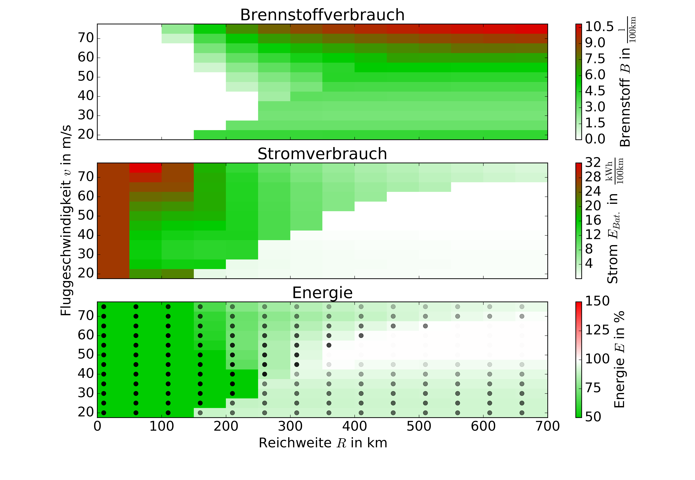

# comparison of hybrid propulsionsystems in small aircrafts

This repo contains the python code of my bachelor thesis.
It simulates a flight of a small aircraft (Stemme S6) using different hybrid propulsion architectures and compares the energy consumption.

A detailed description of the methods and a manual how to use this programme can be found in the [thesis](docs/BA_Hybridantriebe_in_Flugzeugen.pdf), but its written in German.

* main.py
  * starts a calculation for a configuration and a flight mission specified in data/mission/...
    * either the programme tries to optimize and finds the propulsion architecture with the lowest energy consumption (Optimizer.py)
    * or a complete analysis can be made (Mesh.py) where a complete dataset of variable combustion engine size and electric engine size (for bot parallel and serial hybrid) will be generated

example results of one analysis:

the mission is a simple traffic circuit with a climb to 1000 m, flight time: 9 minutes 10 seconds.

results for the parallel hybrid

results for the serial hybrid

### note

this project uses [aerocalc for python](https://kilohotel.com/python/aerocalc/)
